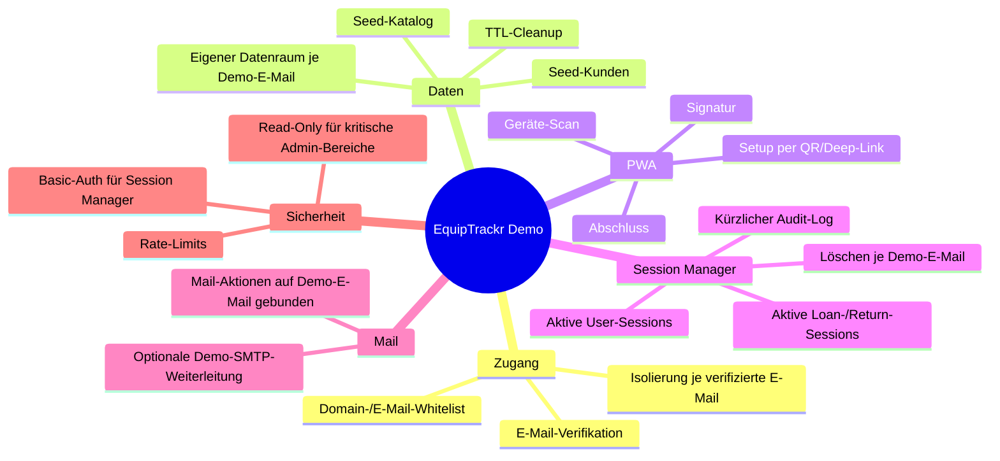

# EquipTrackr - Demo-Dokumentation

Diese Datei enthält ausschließlich Demo-spezifische Funktionen, Sicherheitsregeln und Betriebsdetails.

## 1. Demo-Mindmap

## 2. Zugriff und Isolation

- Einstieg: `/demo/access`
- Nach Verifikation wird die Session auf die bestätigte Demo-E-Mail gebunden.
- Alle erzeugten Demo-Daten (Kunden, Reservierungen, Ausleih-/Rückgabe-Sessions) bleiben auf diese E-Mail isoliert.
- Mail-Aktionen im Demo-Kontext werden an diese Demo-E-Mail adressiert.

## 3. Demo Session Manager

- UI: `/demo/session-manager`
- API: `/api/public/demo-session-manager`
- Aktiv nur bei `DEMO_MODE=true`
- Zugriffsschutz via Basic Auth:
  - `DEMO_SESSION_MANAGER_USERNAME`
  - `DEMO_SESSION_MANAGER_PASSWORD`

Angezeigte Informationen:
- aktive Nutzer-Sessions inkl. Benutzer, Rolle, E-Mail, IP, Last-Seen, Ablaufzeit
- aktive Ausleih- und Rückgabe-Sessions je Demo-E-Mail
- Objektzähler je Demo-E-Mail (Kunden, Reservierungen, Ausleihen)
- **kürzliche Audit-Aktivität** je Demo-E-Mail:
  - Zeitstempel
  - Aktion
  - Entität + Entitäts-ID
  - ausführender Nutzer
  - Detaildaten (JSON)

Administrative Aktion:
- „Alle Demo-Daten löschen“ pro Demo-E-Mail (inkl. Mappings, Sessions, Reservierungen, Ausleihen und Dokumentbezug)

## 4. Demo-ENV-Konfiguration

Zentrale Variablen:
- `DEMO_MODE`
- `DEMO_DATA_TTL_MINUTES`
- `DEMO_SESSION_MANAGER_USERNAME`
- `DEMO_SESSION_MANAGER_PASSWORD`
- `DEMO_POLICY_OVERRIDES_JSON`
- `DEMO_SMTP_ENABLED`
- `DEMO_SMTP_HOST`
- `DEMO_SMTP_PORT`
- `DEMO_SMTP_SECURE`
- `DEMO_SMTP_USER`
- `DEMO_SMTP_PASSWORD`
- `DEMO_SMTP_FROM`

Referenz:
- `demo.env.example`

## 5. Seed- und Platzhalterverhalten

- Bei leerem Demo-Bestand wird ein Grundkatalog mit Kategorien/Artikeln erzeugt.
- Pro Demo-E-Mail werden Demo-Kunden erzeugt, um sofort testbare Ausleihen zu ermöglichen.
- Für Artikel ohne eigene Galerie werden Demo-Platzhalterbilder verwendet.

## 6. Cleanup und Retention

- Demo-Daten werden regelmäßig bereinigt (TTL/Retention).
- Empfohlene Frequenz im Demo-Betrieb: stündlich.
- Cleanup läuft über denselben Job-Mechanismus wie im Hauptsystem.

## 7. Sicherheitsgrenzen im Demo-Modus

- Kritische Systemkonfigurationen bleiben im Demo-Modus read-only.
- Session-Manager ist separat abgesichert (Basic Auth).
- Rate-Limits und serverseitige Validierung gelten identisch wie im Hauptsystem.
- Demo ist für Vorführung/Tests gedacht, nicht für produktiven Live-Betrieb.
