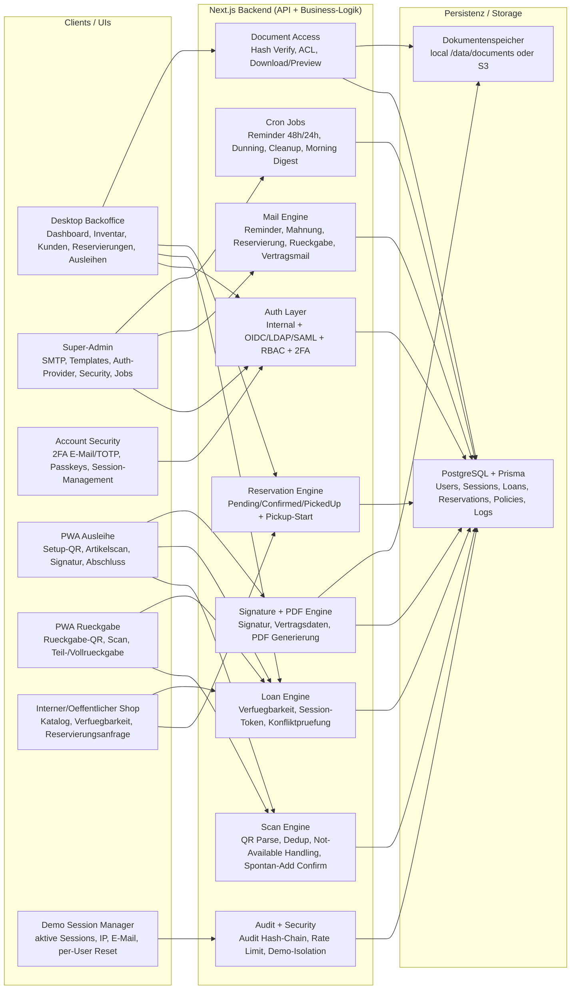
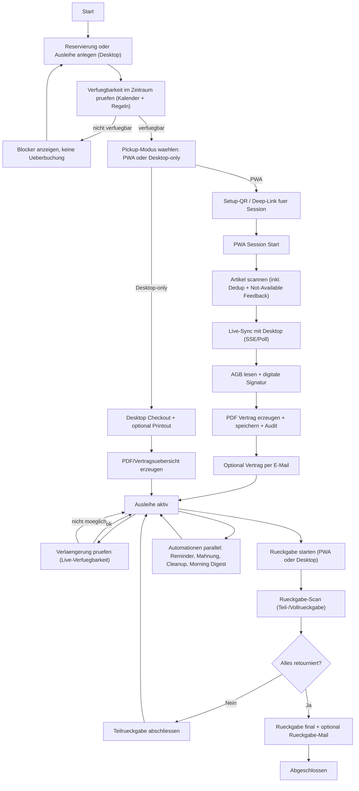
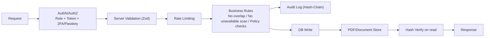

# EquipTrackr - Gesamtdokumentation

Diese Dokumentation ist die verbindliche Referenz fuer das gesamte System (Desktop-App, PWA, API, Sicherheit, Betrieb).

## 1. Produktueberblick

EquipTrackr ist eine produktionsreife Ausleih- und Inventar-Webapp fuer Geraeteparks mit klar getrennter Bedienlogik:
- Desktop-Hauptsystem fuer Verwaltung, Planung, Ausleih-Setup, Reporting und Administration
- Touch-optimierte PWA fuer operative Prozesse (QR-Scan, Signatur, Rueckgabe)

Kernziele:
- Revisionssichere Ausleihen mit Dokumentation
- Schneller operativer Checkout per Mobilgeraet
- Nachvollziehbarkeit je Einzelgeraet (unique InventoryTag/Seriennummer)
- Rollenbasiertes Sicherheitsmodell

---

## 2. Architektur

### 2.1 Komponenten
- Frontend Desktop: Next.js App Router + Bootstrap 5
- Frontend PWA: eigene Route-Gruppe `/(pwa)/pwa/*`, touch-optimiert
- Backend: Next.js Route Handler (TypeScript)
- Datenbank: PostgreSQL + Prisma ORM
- Authentifizierung:
  - intern (Benutzername/Passwort)
  - OIDC/LDAP/SAML optional konfigurierbar
- Dokumentengenerierung: serverseitig (PDF)
- Dokumentenspeicher:
  - lokal (`/data/documents`) oder
  - S3-kompatibel

### 2.2 Fuehrendes System
Das Desktop-System ist fachlich fuehrend:
- Ausleihrahmen wird dort erstellt (Kunde, Zeitraum, geplanter Inhalt)
- PWA arbeitet auf tokenbasierter Session gegen dieselben Serverdaten

### 2.3 Gesamtvisualisierung (Mermaid)

#### 2.3.1 Systemlandschaft (alle Hauptmodule)



#### 2.3.2 End-to-End Funktionsfluss (breit)



#### 2.3.3 Sicherheits- und Governance-Punkte



---

## 3. Rollen- und Berechtigungskonzept

### 3.1 Rollenmodell

Systemrollen:
- `ADMIN`: volle Fachverwaltung
- `MANAGER`: operative Verwaltung (ohne globale Admin/Super-Admin-Einstellungen)
- `OPERATOR`: operative Ausleihe/Rueckgabe (Desktop + PWA-Flow)
- `USER`: interner Shop-Zugriff fuer Reservierungsanfragen + Kontosicherheit

Hinweis `SUPER_ADMIN`:
- Es gibt keine separate DB-Rolle `SUPER_ADMIN`.
- Super-Admin ist eine **erweiterte Faehigkeit** fuer bestimmte `ADMIN`-Konten (z. B. definierte Usernamen), geprueft ueber `isSuperAdminUser`.

### 3.2 Sichtbarkeit und Zugriff (Desktop)

| Bereich | ADMIN | MANAGER | OPERATOR | USER |
|---|---|---|---|---|
| Dashboard | Ja | Ja | Ja | Nein |
| Ausleihe erstellen | Ja | Ja | Ja | Nein |
| Reservierungen | Ja | Ja | Ja | Nein |
| Ausleihen | Ja | Ja | Ja | Nein |
| Dokumente | Ja | Ja | Ja | Nein |
| Stammdaten (Kategorien, Artikel, Kunden) | Ja | Ja | Nein | Nein |
| Einstellungen | Ja | Ja | Nein | Nein |
| Self-Service intern | Ja | Ja | Nein | Nein |
| Shop (intern) | Ja | Ja | Ja | Ja |
| Konto-Sicherheit | Ja | Ja | Ja | Ja |
| Super-Admin | Optional (nur freigeschaltete Admins) | Nein | Nein | Nein |

### 3.3 API-Berechtigungen (Kurzfassung)

- `ADMIN`/`MANAGER`/`OPERATOR`: operative Ausleih- und Dokument-APIs.
- `ADMIN`/`MANAGER`: Stammdaten-Mutationen und erweiterte Verwaltung.
- `USER`: kein Zugriff auf interne Loan-/Document-/Self-Service-Backoffice-APIs.
- `USER` darf intern den Shop nutzen (Session-Bootstrap), Reservierungen anfragen und Kontosicherheit nutzen.

### 3.4 Shop-Auth-Verhalten

- **Eingeloggte interne Nutzer**: Shop ohne OTP (serverseitiger Session-Bootstrap).
- **Oeffentlicher Shop-Zugang**: OTP-Verifikation weiterhin aktiv.

### 3.5 Durchsetzung

Die Berechtigungen werden mehrfach durchgesetzt:
- Navigation pro Rolle (sichtbare Menues)
- zentrale Routenpruefung in `src/proxy.ts` (kein URL-Bypass)
- serverseitige API-Autorisierung ueber `requireRole(...)`
- tokenisierte PWA-Endpunkte mit eigener Token-/Statuspruefung

---

## 4. Desktop-App (Backoffice)

### 4.1 Dashboard
Pfad: `/dashboard`

Enthaelt u. a.:
- aktive Ausleihen
- ueberfaellige Ausleihen
- operative Kennzahlen
- Statuskarten und Schnellnavigation

### 4.2 Stammdatenverwaltung
Pfade:
- `/categories`
- `/article-categories`
- `/articles`
- `/customers`

Funktionen:
- vollstaendige CRUD-Operationen
- Filter-/Suchfunktionen fuer groessere Datenmengen
- automatische Generierung eindeutiger Inventar-Tags bei Neuerfassung
- artikelbezogene Detailseite pro Objekt (`/articles/[id]`) fuer erweitertes Editing
- technischer Lifecycle-Status je Geraet:
  - `Verfuegbar`
  - `Defekt`
  - `In Reparatur`
  - `Ausgemustert`
- Lifecycle-Status steuert die Ausleihbarkeit serverseitig:
  - nicht `Verfuegbar` => automatisch nicht ausleihbar/reservierbar/scannbar
- Bildgalerie je Artikel (mehrere Bilder), inkl. web-optimiertem Upload

### 4.3 Ausleihen
Pfade:
- `/loan-create` (Ausleihe anlegen/planen)
- `/loans` (Ausleihuebersicht, Details, Status)

Wichtige Funktionen:
- Ausleihzeitraum mit Von/Bis
- Verfuegbarkeitspruefung im Zeitraum
- Geraetekalender pro Artikel (Detailansicht) mit Tagesmarkierung:
  - gruen = frei
  - rot = belegt/nicht verfuegbar
  - inkl. belegender Zeitraeume aus Ausleihen, aktiven Ausleih-Sessions und Reservierungen
- Artikelplanung und Session-QR fuer PWA
- Desktop-only Abschluss als Alternative moeglich
- In der Detailansicht von `/loans`:
  - Verlängerung per interaktivem Kalenderfeld (`datetime-local`) mit Live-Verfügbarkeitsprüfung
  - Sofortige Blockeranzeige, wenn Verlängerung im Zielzeitraum nicht möglich ist (inkl. betroffener Artikel)
  - Teilrückgabe per Desktop (einzelne Artikel entfernen) oder per PWA-Rückgabe-Session mit Partial-Return

### 4.4 Dokumente
Pfad: `/documents`

Funktionen:
- Abruf der erzeugten Vertrags-/Ausleih-PDFs
- Berechtigungspruefung beim Zugriff
- Integritaetspruefung (Hash-Verify)

### 4.5 Einstellungen
Pfad: `/settings`

Typische Bereiche:
- Leihdauer/Verlaengerungsregeln
- Signatur- und Dokumentoptionen
- Reminder-/E-Mail-bezogenes Verhalten

### 4.6 Super-Admin
Pfad: `/super-admin`

Umfasst u. a.:
- SMTP-Konfiguration + Testversand
- E-Mail-Templates
- Auth-Provider-Konfiguration (OIDC/LDAP/SAML)
- Sicherheitsrichtlinien (inkl. 2FA-Pflicht je Rolle)
- erweitertes User-Management
- Jobs & Cron-Transparenz:
  - Laufhistorie fuer Reminder-/Cleanup-Jobs
  - inkl. detaillierter Ergebnisdaten pro Lauf (JSON)
  - manuelles Triggern nur ausserhalb Demo-Modus

### 4.7 Nutzer-Sicherheitsbereich
Pfad: `/account-security`

Funktionen:
- aktive Sessions/Geraete einsehen
- einzelne Sessions widerrufen
- 2FA (TOTP, E-Mail) und Passkey-Funktionen

---

## 5. PWA (iPad/iPhone, Touch-Flow)

### 5.1 Ziele
- minimale Reibung im operativen Prozess
- kamera-zentrierte Bedienung
- klare visuelle Rueckmeldung bei erfolgreichem/fehlgeschlagenem Scan

### 5.2 Relevante Pfade
- `/pwa`
- `/pwa/login`
- `/pwa/start/[token]`
- `/pwa/session`
- `/pwa/scan`
- `/pwa/signature`
- `/pwa/return/*`

### 5.3 Standard-Ausleihprozess
1. Desktop erstellt Ausleih-Session und zeigt QR/Deep-Link
2. Mobilgeraet oeffnet Session direkt via Token-Link oder QR
3. Scan der Geraete in die laufende Session
4. Validierung (existiert, verfuegbar, nicht doppelt)
5. Signatur durch ausleihende Person
6. Finalisierung inkl. PDF-Erstellung und optional E-Mail-Versand

Hinweis:
- Der E-Mail-Versand aus der PWA funktioniert ohne separates PWA-Login ueber den aktiven Session-Token (serverseitig validiert gegen die zugehoerige Ausleih-Session).

### 5.4 Rueckgabeprozess (auch Desktop-only moeglich)
- Rueckgabe-Session starten
- Artikel scannen
- Vollstaendigkeitspruefung
- Abschluss + optionale Bestaetigungsmail

### 5.5 PWA-Reset
Funktion vorhanden, um lokale Session-/Cache-Zustaende zurueckzusetzen und neuen Vorgang sauber zu starten.

---

## 6. QR- und Identifikationsmodell

### 6.1 Eindeutigkeit
- Jeder physische Artikel besitzt eindeutigen `inventoryTag`
- Seriennummern sind ebenfalls eindeutig/validiert
- QR-Codes referenzieren eindeutig auf Einzelobjekte oder Session-Token

### 6.2 Session-Token
- kryptografisch starke, nicht erratbare Tokens
- zeitlich begrenzt
- serverseitig gegen Status/Gueltigkeit geprueft
- nach Abschluss/Abbruch invalidierbar

### 6.3 Verfuegbarkeit
- Ausleihkonflikte werden anhand Zeitraum geprueft
- nicht finalisierte/abgebrochene Sessions duerfen Verfuegbarkeit nicht dauerhaft blockieren

---

## 7. Digitale Signatur & PDF-Vertrag

### 7.1 Signaturdaten
Bei Signatur werden u. a. erfasst:
- Zeitstempel (UTC)
- ausfuehrender Nutzer (Operator/abwickelnde Person)
- ausleihende Person (Kunde)
- Artikelkontext
- User-Agent
- IP (falls verfuegbar)

### 7.2 Dokumenterzeugung
- serverseitige PDF-Generierung
- Vertragstext/AGB-Bereich (anpassbar)
- Darstellung von Kunde, Zeitraum, Artikel, abwickelnde Person
- Signaturabbild wird in Dokument eingebettet

### 7.3 Integritaet und Nachvollziehbarkeit
- Dokumenthash wird gespeichert
- Dokumentpfad und Metadaten werden mit Loan verknuepft
- Audit-Event `documentCreated`/`documentViewed`

Hinweis: Technische Hash-Details muessen nicht zwingend im sichtbaren Kundentext erscheinen, bleiben aber systemseitig fuer Revisionszwecke vorhanden.

---

## 8. E-Mail-Automation

Funktionen:
- Reminder vor Fälligkeit (48h/24h)
- Mehrstufiger Mahnlauf bei Überfälligkeit (Stufe 1/2/3)
  - Schwellwerte (Tage überfällig) zentral in `Policy` konfigurierbar
  - Mahngebühren für Stufe 2/3 zentral in `Policy` konfigurierbar
  - Cooldown zwischen Mahnstufen-Mails (Stunden) konfigurierbar
- Versand von Vertrags-/Ausleihdokumenten
- Rueckgabe-Bestaetigung optional
- Reservierungsbestaetigung (bei Anlage)
- Abhol-Erinnerung 24h vor Reservierungsstart
- 07:00 Dienst-Übersicht an definierte Dienstperson + Vertretung
- SMTP-Test im Adminbereich
- Logging mit Retry-Informationen

Demo-Hinweis:
- Auch in Demo kann SMTP serverseitig aktiv sein, falls ENV gesetzt.

---

## 8.1 Cleanup-Strategie (DB-Hygiene / Retention)

Ziel:
- regelmaessige Bereinigung von kurzlebigen und veralteten Datensaetzen
- stabile Performance bei langen Laufzeiten
- klare Aufbewahrungsfenster statt unbegrenztem Wachstum

Implementierung:
- zentraler Cleanup-Job: `runCleanup` in `src/lib/jobs/run-cleanup.ts`
- API-Trigger: `POST /api/cron/cleanup`
- CLI-Trigger: `npm run cron:cleanup` (optional `-- --dry-run`)
- parallele Ausfuehrungen werden via PostgreSQL Advisory Lock verhindert

Aufraeumregeln (konfigurierbar per ENV):
- Auth-Login-Tokens (abgelaufen/alt)
- User-Sessions (abgelaufen oder widerrufen, aelter als Retention)
- Shop-Sessions und OTP-Challenges (abgelaufen/alt)
- Loan-/Return-Sessions (abgelaufen oder abgeschlossen/storniert und alt)
- alte stornierte/abgelehnte Reservierungen ohne aktive Pickup-Verknuepfung
- alte `EmailLog`- und `AuditLog`-Eintraege
- verwaiste Dokumente (`Document` ohne Loan-Referenz) inkl. File-Delete im Storage
- alte Demo-Mapping-Eintraege (`SystemSetting` mit `demo.email.*`)

Empfohlene Job-Frequenz:
- Produktion: alle 6h (`0 */6 * * *`)
- Demo: stündlich (`0 * * * *`)
- fuer dry-run Monitoring zusaetzlich taeglich ein Reportlauf

Sicherheit beim Trigger:
- entweder als eingeloggter `ADMIN`
- oder per `Authorization: Bearer <CRON_TOKEN>` (fuer externe Scheduler)

---

## 9. Self-Service

Der interne Self-Service-Bereich (`/self-service`) ist fuer `ADMIN` und `MANAGER` verfuegbar.
Funktionen:
- Einsicht laufender Ausleihen aus interner Perspektive
- Verlaengerung im Rahmen der Policy

Fuer `USER` gilt stattdessen:
- Zugriff auf den internen Shop (`/shop`) fuer Reservierungsanfragen
- Zugriff auf Kontosicherheit (`/account-security`)

### 9.1 Oeffentliche Shop-Artikel-Details
- Oeffentliche Detailseite pro Artikel: `/shop/articles/[id]`
- Enthalten: Stammdaten, Beschreibung, technische Kategorie, Galerie
- Shop-Listenansicht verlinkt direkt auf die jeweilige Detailseite
- Bilder werden ueber oeffentliche, cachebare Bildroute ausgeliefert

---

## 10. Datenmodell (Auszug)

Wichtige Entitaeten:
- `Category`, `ArticleCategory`, `Article`, `Customer`
- `Loan`, `LoanItem`
- `LoanSession`, `LoanSessionItem`
- `ReturnSession`
- `Document` (bzw. Dokumentbezug auf Loan)
- `AuditLog`
- `EmailLog`
- `Policy`, `Setting`
- `User`, `Session`, 2FA/Passkey-bezogene Daten

Loan-relevante Felder (erweitert):
- `signedAt`
- `signatureImagePath`
- `documentPath`
- `documentHash`
- `signingMetadata`
- `dunningLevel`
- `dunningFeeCents`
- `lastDunningAt`

Audit-Aktionen (u. a.):
- `documentCreated`
- `documentViewed`

Referenz: `prisma/schema.prisma`

---

## 11. Sicherheit (Ist-Stand)

- serverseitige Zod-Validierung
- rollenbasiertes Authorization-Mapping pro Endpoint
- Rate-Limiting fuer kritische Pfade (Auth, OTP, Scan, Finalize, Public Reservation-Endpunkte)
- Passwort-Hashing mit `argon2id` (inkl. Legacy-Migration)
- 2FA (E-Mail/TOTP) + Passkey-Unterstuetzung
- 2FA-Pflicht je Rolle durch Super-Admin konfigurierbar
- Verschluesselung sensibler Felder at-rest
- Audit-Log mit Hash-Chain zur Manipulationserkennung
- geschuetzter Zugriff auf Dokumente
- tokenisierte PWA-Endpunkte mit Ablauf- und Statuspruefung
- Request-Body-Limit fuer JSON-Payloads (`MAX_JSON_BODY_BYTES`)
- lokale Dokumentzugriffe auf `LOCAL_DOCUMENT_DIR` begrenzt
- Secrets in Super-Admin-GETs maskiert; Speicherung von SMTP/OIDC/SAML/LDAP-Secrets verschluesselt

Empfohlene laufende Härtung:
- strikte Secret-Rotation
- Monitoring/Alerting fuer Security-Events
- regelmaessige Restore-Tests (DB + Dokumente)
- SAST/Dependency-Scanning in CI

---

## 12. API-Uebersicht (wichtige Gruppen)

### 12.1 Auth
- `/api/auth/[...nextauth]`
- Passkey/TOTP-bezogene Endpunkte unter `/api/auth/passkey/*` und `/api/user/security/*`

### 12.2 Stammdaten
- `/api/categories`
- `/api/article-categories`
- `/api/articles`
- `/api/customers`

### 12.3 Ausleihe
- `/api/loan-sessions`
- `/api/loan-sessions/[id]/qr`
- `/api/loan-sessions/by-token/[token]/*`
- `/api/scan`
- `/api/checkout`
- `/api/checkout/desktop`
- `/api/loans`

### 12.4 Rueckgabe
- `/api/return-sessions/*`

### 12.5 Dokumente
- `/api/documents`
- `/api/documents/[id]`

### 12.6 Admin/Super-Admin
- `/api/admin/system-config`
- `/api/admin/email-templates`
- `/api/admin/smtp-test`
- `/api/admin/auth/test`
- `/api/admin/users`
- `/api/admin/job-runs`

### 12.7 Self-Service & Jobs
- `/api/self-service/*`
- `/api/cron/reminders`
- `/api/cron/cleanup`

---

## 13. ENV-Konfiguration

### 13.1 Kern
- `NODE_ENV`
- `NEXTAUTH_URL`
- `NEXTAUTH_SECRET`
- `DATABASE_URL`

### 13.2 Dokument-Storage
- `STORAGE_MODE=local|s3`
- `LOCAL_DOCUMENT_DIR`
- `S3_ENDPOINT`
- `S3_REGION`
- `S3_BUCKET`
- `S3_ACCESS_KEY_ID`
- `S3_SECRET_ACCESS_KEY`

### 13.3 Sicherheit
- `DATA_ENCRYPTION_KEY`
- `SUPER_ADMIN_USERNAMES`
- `RATE_LIMIT_POINTS`
- `RATE_LIMIT_DURATION`
- `LOAN_SESSION_TTL_HOURS`
- `MAX_JSON_BODY_BYTES`
- `CRON_TOKEN`

### 13.6 Cleanup / Retention
- `CLEANUP_EMAIL_LOG_RETENTION_DAYS`
- `CLEANUP_AUDIT_LOG_RETENTION_DAYS`
- `CLEANUP_AUTH_TOKEN_RETENTION_DAYS`
- `CLEANUP_USER_SESSION_RETENTION_DAYS`
- `CLEANUP_SHOP_SESSION_RETENTION_DAYS`
- `CLEANUP_SHOP_OTP_RETENTION_DAYS`
- `CLEANUP_LOAN_SESSION_RETENTION_DAYS`
- `CLEANUP_RETURN_SESSION_RETENTION_DAYS`
- `CLEANUP_RESERVATION_RETENTION_DAYS`
- `CLEANUP_ORPHAN_DOCUMENT_RETENTION_DAYS`
- `CLEANUP_DEMO_MAPPING_RETENTION_DAYS`

### 13.4 SMTP
- `SMTP_HOST`
- `SMTP_PORT`
- `SMTP_SECURE`
- `SMTP_USER`
- `SMTP_PASSWORD`
- `SMTP_FROM`

### 13.5 Demo
- `DEMO_MODE`
- `DEMO_DATA_TTL_MINUTES`
- `DEMO_SMTP_*`

Referenzdateien:
- `.env.example`
- `demo.env.example`

---

## 14. Lokaler Betrieb

### 14.1 Vollstart mit Docker
```bash
docker compose --env-file demo.env.example down -v --remove-orphans
docker compose --env-file demo.env.example up --build -d
```

### 14.2 Erreichbarkeit
- HTTPS lokal (Proxy): `https://<LAN-IP>:3443`
- App intern: Port 3001
- PostgreSQL: Port 5432

### 14.3 LAN-Test mit Mobilgeraet
- Mobilgeraet im gleichen Netzwerk
- URL mit LAN-IP verwenden
- bei Self-Signed Zertifikat Zertifikat vertrauen
- Kamera benoetigt HTTPS-Kontext

---

## 15. Demo-Betrieb

Ziele:
- schnelle Produktdemo mit realistischem Flow
- isolierte Demo-Daten
- automatisches Aufraeumen via TTL

Eigenschaften:
- vordefinierte Rollen und Testdaten
- demo-spezifische Scanlinks im Ausleihkontext
- optional SMTP auch in Demo aktivierbar
- Demo-Zugang erfolgt ueber E-Mail-OTP-Gate auf `/demo/access` (vor regulaerem Login)
- nach OTP-Verifikation ist der Zugang auf die verifizierte Demo-E-Mail gebunden
- alle Mail-Aktionen der in dieser Session erzeugten Ausleih-/Rueckgabe-Sessions werden auf diese Demo-E-Mail umgeleitet
- Zuordnung ist session-isoliert, damit parallele Demo-Nutzer sich nicht gegenseitig Daten oder Mail-Ziele ueberschreiben
- bei leerem Demo-Bestand wird automatisch ein Grundkatalog erzeugt (Kategorien, Artikelkategorien, umfangreicher Artikelbestand)
- pro Demo-E-Mail werden automatisch Demo-Kunden erzeugt, damit Ausleihen sofort testbar sind
- OTP-Whitelist erfolgt ueber Policy (`allowedOtpDomains`, `allowedOtpEmails`), aktuell inkl. `felgner.ch` und `phtg.ch`

---

## 16. Bekannte Betriebsregeln

- Nach `NEXTAUTH_SECRET`-Aenderung alte Browser-Sessions loeschen (sonst JWT-Fehler moeglich)
- Bei massiven Datenmengen auf Indizes, Pagination und serverseitiges Filtering achten
- QR-/Kamera-Funktionen nur mit stabilem HTTPS und Berechtigungen nutzen

---

## 17. Roadmap-Empfehlungen

- feinere BI-Statistiken (Nutzungsmuster, Auslastung, Engpassprognosen)
- erweiterte Reporting-Exporte
- Mandantenfaehigkeit (falls benoetigt)
- revisionssichere Dokumentensignierung mit externer Signaturinfrastruktur (optional)

---

## 18. Wartungsregel fuer künftige Anpassungen

Diese Datei ist **Pflichtbestandteil der Entwicklung**. Bei jeder Aenderung gilt:
1. Feature implementieren
2. Tests/Lint ausfuehren
3. **`docs/README.md` aktualisieren**
4. erst dann PR abschliessen

Empfehlung fuer PR-Template:
- [ ] Doku in `docs/README.md` aktualisiert
- [ ] Neue ENV-Variablen dokumentiert
- [ ] API-Aenderungen dokumentiert

### 18.1 Public-Docs Sync (GitHub)

Das private Hauptrepo publiziert die Doku automatisch in ein separates, oeffentliches Repo:
- Workflow: `.github/workflows/publish-public-docs.yml`
- Trigger: Push auf `main` bei Aenderungen unter `docs/**`
- Zielrepo (Default): `bjoernch/EquipTrackr-docs`

Erforderlich:
- Secret `DOCS_PUBLISH_TOKEN` (PAT mit Schreibrecht auf das Public-Docs-Repo)
- Variable `DOCS_PUBLISH_REPO` (optional, z. B. `owner/repo`)

Verhalten:
- Inhalt von `docs/` wird in das Public-Repo gespiegelt
- `docs/README.md` wird als `README.md` im Public-Repo bereitgestellt
- Push erfolgt nur bei tatsaechlichen Dateiaenderungen

---

## 24. Skalierung, Referenzen, Monitoring, Backup (aktuell)

### 24.1 Kurze Ausleih-Referenz (loanNo)

Jede Ausleihe besitzt eine kurze, eindeutige Referenz (`Loan.loanNo`), z. B. `L26-AB12CD3`.

- technisch eindeutig über Unique-Constraint
- in UI/E-Mail/PDF als primäre Referenz verwendet
- interne CUID bleibt als technische Primär-ID erhalten

### 24.2 Cursor-Pagination für große Datenbestände

Für hohe Datenvolumina unterstützen Kernendpunkte Cursor-Pagination:

- `GET /api/customers?cursor=<id>&pageSize=50`
- `GET /api/articles?paginate=1&cursor=<id>&pageSize=60`
- `GET /api/loans?paginate=1&cursor=<id>&pageSize=50`

### 24.8 API: Verlängerung von Ausleihen (Detailansicht)

Neue Endpunkte:
- `GET /api/loans/:id/extend?dueDate=<iso>`
  - prüft live, ob Verlängerung im gewünschten Zeitraum möglich ist
  - berücksichtigt laufende Ausleihen, aktive Ausleih-Sessions und Reservierungen
  - liefert bei Blockierung die konkreten blockierenden Artikel
- `POST /api/loans/:id/extend`
  - führt Verlängerung nur aus, wenn der Live-Check erfolgreich ist
  - schreibt Audit-Log `loanUpdated` mit `operation=extendLoan`

### 24.9 Demo-Read-Only für Einstellungen

Im Demo-Modus ist `PUT /api/settings` schreibgeschützt (HTTP 403).

Serverseitige Steuerung erfolgt über:
- `DEMO_POLICY_OVERRIDES_JSON`

Beispiel:
```json
{"defaultLoanDays":7,"maxLoanDays":30,"allowExtension":true}
```

Die Overrides werden bei `GET /api/settings` (und in der Super-Admin-Systemansicht) auf die Policy gemerged und im UI als read-only angezeigt.

### 24.10 Demo-Placeholderbilder für Artikel

Im Demo-Modus erhalten Artikel ohne eigene Galerie automatisch ein Platzhalterbild.

- 3 feste Varianten, rotierend über alle Artikel
- Quellen:
  - `/demo/placeholders/demo-1.svg`
  - `/demo/placeholders/demo-2.svg`
  - `/demo/placeholders/demo-3.svg`
- Datenpfad in `ArticleImage.path`: `placeholder://demo-1..3`
- Öffentlicher Abruf wird in `GET /api/public/article-images/:id` auf die statischen SVGs umgeleitet.

Antwort enthält jeweils `nextCursor`.

### 24.11 Ausleihe erstellen: Schritt 2 ist editierbar (Live-Sync)

Im Desktop-Flow `/loan-create` bleibt der Abschnitt mit Kundenzuordnung und Zeitraum (`Von`/`Bis`) in Schritt 2 bewusst editierbar.

Neu:
- Änderungen an Kunde, Start und Ende werden serverseitig synchronisiert, bevor Artikelzuweisungen final übernommen werden.
- Nicht gespeicherte Änderungen blockieren den nächsten Schritt, bis die Synchronisierung erfolgreich ist.
- Die Verfügbarkeitsprüfung arbeitet damit immer gegen den aktuellen Zeitrahmen.

Neue API:
- `PUT /api/loan-sessions/:id`
  - aktualisiert `customerId`, `startsAt`, `dueDate`
  - vollständig serverseitig validiert (Zod)
  - mit Rollenprüfung (`ADMIN`, `MANAGER`, `OPERATOR`)

### 24.12 PWA-Setup-QR als Deep-Link (Native Kamera/Scanner)

Der Setup-QR im Desktop ist als vollwertiger HTTPS-Deep-Link nutzbar.

- Scan mit normaler Kamera-App oder beliebiger QR-Scanner-App öffnet direkt die PWA-Session.
- Kein erzwungener manueller URL-Einstieg in der PWA nötig.
- Danach erfolgt direkt der Geräte-Scanflow.

### 24.13 Demo-Mode: Schreibschutz für zentrale Admin-Bereiche

Im Demo-Modus sind zentrale Systemeinstellungen bewusst gesperrt:
- Policy-Settings nur lesbar
- Super-Admin-Sicherheits-/SMTP-Konfigurationen nur lesbar
- Steuerung erfolgt über ENV auf Serverebene

Ziel:
- reproduzierbare, sichere Demo ohne Konfigurations-Drift
- trotzdem realistische UI-Darstellung mit echten Betriebswerten

### 24.14 Interessenten-/Sales-Sicht: kompletter Funktionsumfang

Für Vorführungen und Interessenten sind folgende Kernpfade vollständig dokumentiert und abbildbar:
- Inventarverwaltung inkl. Kategorien, Artikelzustand, Galerie, Kalender
- Reservierung mit Verfügbarkeitsprüfung im Zeitraum
- Übergang Reservierung -> Pickup (PWA oder Desktop)
- PWA-Scan, spontane Zusatzartikel, Signatur, Vertrags-PDF
- Teilrückgabe und Vollrückgabe inkl. Mail-Bestätigung
- Mahnlauf/Reminder, Report- und Job-Transparenz
- Rollen- und Sicherheitsmodell inkl. 2FA/Passkey

### 24.15 Go-Live-Checkliste (Produktion)

Vor produktivem Betrieb:
1. `DEMO_MODE=false` sicherstellen
2. starke Secrets setzen (`NEXTAUTH_SECRET`, `DATA_ENCRYPTION_KEY`, SMTP-Creds)
3. TLS-Zertifikat + Reverse-Proxy (Nginx/Caddy) aktivieren
4. DB-Backups + Restore-Test (`scripts/backup.sh`, `scripts/restore-test.sh`) einplanen
5. Cron-Jobs aktivieren:
   - Reminder/Mahnlauf
   - Cleanup
   - morgendliche Dienstübersicht
6. Rollenmodell und 2FA-Pflicht je Rolle prüfen
7. Dokument-Storage (local/S3) inkl. Zugriffsrechten verifizieren
8. Monitoring/Alerts für Mailfehler, Jobfehler und Login-Anomalien einschalten

### 24.16 Demo Session Manager (aktive Demo-Sessions)

Für Demo-Betrieb gibt es eine separate, ENV-geschützte Session-Manager-Oberfläche:

- UI: `/demo/session-manager`
- API: `/api/public/demo-session-manager`
- nur aktiv bei `DEMO_MODE=true`
- Zugriff via Basic Auth aus ENV:
  - `DEMO_SESSION_MANAGER_USERNAME`
  - `DEMO_SESSION_MANAGER_PASSWORD`

Funktionen:
- zeigt aktive Demo-Nutzersessions inkl. Benutzer, Rolle, E-Mail, IP, Last-Seen, Expiry
- zeigt aktive Loan-/Return-Sessions je Demo-E-Mail
- zeigt pro Demo-E-Mail Objektzähler (Kunden, Reservierungen, Ausleihen etc.)
- erlaubt „Alle Demo-Daten löschen“ pro Demo-E-Mail (inkl. Session-Mappings, Reservierungen, Loans, Dokumentbezug, Shop-Sessions)

### 24.3 PWA Live-Update via SSE

Endpoint:
- `GET /api/loan-sessions/by-token/:token/events`

Die PWA konsumiert diesen Stream via `EventSource`.
- Session-Änderungen erscheinen ohne aggressives Polling
- Fallback-Polling bleibt aktiv für robuste Netze

### 24.4 Security-Hardening: Admin-IP-Allowlist

Neue ENV:
- `ADMIN_IP_ALLOWLIST` (CSV, optional)

Verhalten:
- gilt für `ADMIN`/Super-Admin-Routen
- wenn gesetzt, ist Zugriff nur von erlaubten Quell-IPs möglich

### 24.5 PDF-Template-Versionierung

Neue Felder:
- `Loan.documentTemplateVersion`
- `Document.templateVersion`

Aktuelle Version: `loan-v3`.

Damit ist bei zukünftigen PDF-Änderungen nachvollziehbar, welche Dokumentversion erzeugt wurde.

### 24.6 Super-Admin Monitoring-KPIs

Neuer Endpoint:
- `GET /api/admin/metrics`

Liefert kompakte Betriebsmetriken:
- aktive/überfällige Ausleihen
- offene Reservierungen
- E-Mail-Fehler 24h/7d
- erfolgreiche Reminder-/Cleanup-Runs (7d)

### 24.7 Backup/Restore-Skripte

Neue Skripte:
- `scripts/backup.sh`
- `scripts/restore-test.sh`

NPM-Wrapper:
- `npm run backup:create -- ./backups`
- `npm run backup:restore-test -- ./backups/<timestamp> <postgres-url>`

Hinweis:
- Backup umfasst Postgres-Dump plus Dokument-Archiv (lokaler Storage).
